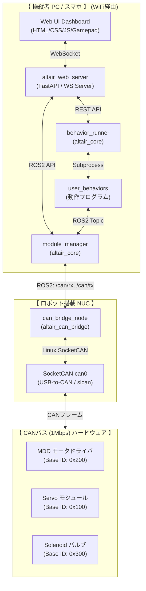

# Altair Framework システム設計書 (architecture.md)

本ドキュメントは、CANバス（1 Mbps）で統一されたアクチュエータ制御モジュール群「Altair Module System」を一括制御するROS2パッケージ **「altair_framework」** の全体アーキテクチャ、データフロー、および状態遷移について詳細に解説する仕様設計書です。

---

## 1. 全体アーキテクチャ概要

本システムは、実機に直接USB-to-CAN（CANable 2）で物理接続されるロボット（NUC）側のコンポーネントと、操作・意思決定を行う操縦PC/スマホ側のコンポーネントを、同一のWiFi（ローカルネットワーク）を介して完全に **「疎結合」** に連携させます。

### ノードおよびパケットの構成関係



### アーキテクチャの優位性
- **NUC側の「完全固定化」 (メンテナンス性向上)**:
  `altair_can_bridge` ノードは、個々のモジュールの種類や数を解釈しません。単に `/altair/can/rx` と `/altair/can/tx` というRaw CANフレーム（`can_msgs/msg/Frame`）をLinuxの `can0` ポートと双方向でそのまま転送するだけです。
  モジュール構成（追加・削除・ID変更）や、PIDなどの制御ロジックは、すべて操縦者PC側の `altair_core` が動的に処理するため、ロボット（NUC）側のプログラムを触る必要が一切ありません。

---

## 2. ROS2 トピック・サービス・データフロー仕様

操縦PC側の `module_manager.py` は、設定ファイル `modules_config.json` をロードし、定義されているモジュール名に対応する制御用トピックを動的生成します。

```text
[モジュール指令 (物理値)]                  [Raw CANフレーム]                [物理CANフレーム]
  /altair/drive_mdd/cmd   ===>  (Manager)  ===>  /altair/can/tx   ===>  (Bridge)  ===>  can0 (0x220)
  /altair/arm_servo/cmd   ===>  (Manager)  ===>  /altair/can/tx   ===>  (Bridge)  ===>  can0 (0x100)
  /altair/valve_ctl/cmd   ===>  (Manager)  ===>  /altair/can/tx   ===>  (Bridge)  ===>  can0 (0x300)

[モジュール返信 (物理値)]                  [Raw CANフレーム]                [物理CANフレーム]
  /altair/drive_mdd/feedback <== (Manager) <==  /altair/can/rx   <==  (Bridge)  <==  can0 (0x230, 240, 250)
```

---

## 3. 状態遷移・シーケンスモデル

MDD（モータドライバ）は、物理的なマイコン側の安全仕様として、起動直後は **「パラメータ設定モード (Setup Mode)」** になります。4モータ分のパラメータが全て揃うまで動作目標値を受け付けないため、以下のシーケンスによってユーザー主導で制御を安全に開始します。

```mermaid
sequenceTrigger:
sequenceDiagram
    autonumber
    actor User as ユーザー (WebUI)
    participant WebServer as WebUI サーバー
    participant Mgr as Module Manager (PC)
    participant Bridge as CAN Bridge (NUC)
    participant MDD as MDDモータドライバ

    Note over MDD: 起動時: パラメータ設定モード<br>(目標値を受け付けない)
    
    User->>WebServer: 「Send Params & Start」をクリック
    WebServer->>Mgr: 制御開始サービスコール (/altair/start_control)
    
    rect rgb(30, 40, 60)
        Note over Mgr: 設定ファイルからPID、車輪径、<br>方向、動作モードをロード
        Mgr->>Bridge: モータ1〜4 パラメータCANフレーム送信 (0x200 - 0x203)
        Bridge->>MDD: CAN送信 (0x200 - 0x203)
        Mgr->>Bridge: モード設定CANフレーム送信 (0x210)
        Bridge->>MDD: CAN送信 (0x210)
    end

    Note over MDD: パラメータ受信完了➔<br>「制御実行モード (Control Mode)」へ自律遷移
    MDD->>Bridge: ステータス返信 (システム状態=1)
    Bridge->>Mgr: トピック配信 (/altair/can/rx)
    Mgr->>WebServer: 状態の更新 (/altair/drive_mdd/feedback)
    WebServer->>User: WebUIのステータス表示が「制御中」に変化

    rect rgb(30, 60, 40)
        Note over User, MDD: 以降、低遅延スライダー操作や動作プログラム(Behavior)からの目標値指令(0x220)が有効化
    end
```

---

## 4. プロファイル管理システム

複数のモジュール構成やパラメータを切り替えるため、Webサーバーは以下のプロファイル読み書きプロセスを調停します。

1. **プロファイルの適用**:
   - ユーザーがUIからプロファイル（例：`arm_test_profile`）を選択します。
   - `web_server_node` が該当するJSONファイルの内容を読み込み、現在の設定ファイル `modules_config.json` に上書きコピーします。
   - Webサーバーは、ROS2サービス `/altair/reload_config` （`module_manager` 提供）を呼び出します。
   - `module_manager` は即座に新しい設定をロードし、トピックを動的再生成（不要なパブリッシャ/サブスクライバを破棄し、新しいモジュール用のものをバインド）します。
   - Webサーバーのフロントエンド監視スループットが自動で同期され、ダッシュボードのカードが瞬時に再描画されます。
