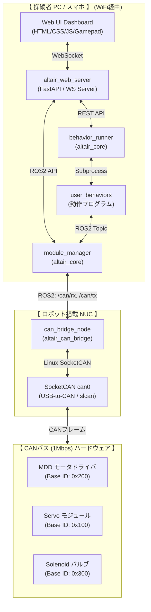

本ドキュメントは、CANバス（1 Mbps）で統一されたアクチュエータ制御モジュール群「Altair Module System」を一括制御するROS2パッケージ **「altair_framework」** の全体アーキテクチャ、データフロー、および状態遷移について詳細に解説する仕様設計書です。

---

## 全体アーキテクチャ概要

本システムは、実機に直接USB-to-CAN（CANable 2）で物理接続されるロボット（NUC）側のコンポーネントと、操作・意思決定を行う操縦PC/スマホ側のコンポーネントを、同一のWiFi（ローカルネットワーク）を介して完全に **「疎結合」** に連携させます。

### システム全体図



---

## 主な設計ポイント

### NUC側の「完全固定化」 (メンテナンス性向上)

`altair_can_bridge` ノードは、個々のモジュールの種類や数を解釈しません。単に `/altair/can/rx` と `/altair/can/tx` というRaw CANフレーム（`can_msgs/msg/Frame`）をLinuxの `can0` ポートと双方向でそのまま転送するだけです。

モジュール構成（追加・削除・ID変更）や、PIDなどの制御ロジックは、すべて操縦者PC側の `altair_core` が動的に処理するため、**ロボット（NUC）側のプログラムを触る必要が一切ありません。**

### 動作プログラムの「動的管理」 (開発効率向上)

`user_behaviors/` ディレクトリに新規プログラムを追加するだけで、即座に WebUI から実行可能になります。ロボット側の `behavior_runner` ノードは新規ファイル自動発見のロジックを内蔵しており、ユーザーは開発環境側の `user_behaviors/` ディレクトリのみを管理すればよいため、**開発速度とイテレーション性が大幅に向上**します。

---

## ROS2 トピック・サービス・データフロー

操縦PC側の `module_manager.py` は、設定ファイル `modules_config.json` をロードし、定義されているモジュール名に対応する制御用トピックを動的生成します。

```text
[モジュール指令 (物理値)]                  [Raw CANフレーム]                [物理CANフレーム]
  /altair/drive_mdd/cmd   ===>  (Manager)  ===>  /altair/can/tx   ===>  (Bridge)  ===>  can0 (0x220)
  /altair/arm_servo/cmd   ===>  (Manager)  ===>  /altair/can/tx   ===>  (Bridge)  ===>  can0 (0x100)
  /altair/valve_ctl/cmd   ===>  (Manager)  ===>  /altair/can/tx   ===>  (Bridge)  ===>  can0 (0x300)

[モジュール返信 (物理値)]                  [Raw CANフレーム]                [物理CANフレーム]
  /altair/drive_mdd/feedback <== (Manager) <==  /altair/can/rx   <==  (Bridge)  <==  can0 (0x230, 240, 250)
```

---

## 関連リンク

- [ホーム](Home)
- [CAN仕様書](CAN仕様書)
- [動作プログラム作成ガイド](動作プログラム作成ガイド)
